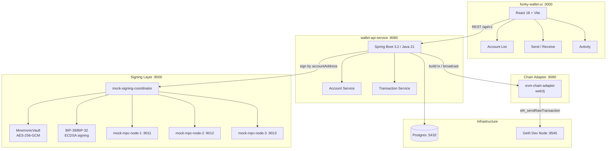

# Funky Wallet

A non-custodial MPC wallet supporting Ethereum (EVM), Solana, and Bitcoin. Private keys are split via threshold signing (MPC/TSS) — no single party ever holds the full key. The signing coordinator is the sole custodian of encrypted key material, which is decrypted ephemerally at signing time and never exposed to callers.

---

## Architecture



### Key security properties

- **Mnemonic displayed once** — generated server-side, shown to user on account creation, never stored in the UI or main database
- **Signing coordinator is sole custodian** — encrypts mnemonic with AES-256-GCM keyed per account; decrypts ephemerally at sign time only
- **Key never leaves the signing layer** — `wallet-api-service` passes `accountAddress` to sign, not the key material itself
- **EIP-155 replay protection** — `chainId` is passed to every signing request

---

## Project layout

```
funky-wallet/                        ← Maestro (orchestrator)
├── CLAUDE.md                        ← Maestro agent identity
├── agent-spec.md                    ← Maestro task list
├── README.md
│
├── funky-wallet-ui/                 ← Pixel (React frontend)
│   ├── CLAUDE.md
│   ├── agent-spec.md
│   └── src/
│       ├── components/
│       │   ├── wallet/              ← Dashboard, Send, Receive, Activity, AccountList
│       │   ├── auth/                ← CreateAccount (2-step chain picker)
│       │   └── shared/             ← Layout, ErrorBoundary, ConfirmationModal
│       ├── hooks/                   ← useWallet (TanStack Query)
│       ├── store/                   ← walletStore (Zustand, confirmationSettings)
│       ├── utils/
│       │   ├── chain.ts             ← chain registry, ENV_COLORS
│       │   └── explorer.ts          ← testnet explorer URLs per network
│       └── api/                     ← Axios REST client
│
├── wallet-api-service/              ← Forge (Java backend)
│   ├── CLAUDE.md
│   ├── agent-spec.md
│   ├── docker-compose.dev.yml       ← Postgres + Adminer
│   └── src/main/java/com/funkywallet/
│       ├── controller/              ← AccountController, TransactionController
│       ├── service/                 ← AccountService, TransactionService
│       ├── client/
│       │   ├── signing/             ← SigningCoordinatorClient (signs by accountAddress)
│       │   └── chain/               ← ChainAdapterClient
│       ├── model/                   ← entities, requests, responses
│       └── resources/db/changelog/  ← Liquibase migrations
│
├── mock-services/                   ← Phantom (mock infra)
│   ├── CLAUDE.md
│   ├── agent-spec.md
│   ├── docker-compose.mock.yml
│   ├── mock-signing-coordinator/    ← BIP-39 derivation, AES vault, real ECDSA
│   ├── mock-mpc-node/               ← in-memory share store (×3)
│   └── mock-chain-adapter/          ← fake broadcast / balance
│
├── evm-chain-adapter/               ← real web3j adapter for Geth e2e
│   └── src/
│
├── geth-dev/                        ← local Geth node (Clique PoA, chainId 1337)
│   ├── genesis.json                 ← 3 pre-funded accounts (100k ETH each)
│   └── Dockerfile
│
├── funky-wallet-e2e/                ← Scout (Playwright e2e tests)
│   ├── CLAUDE.md
│   ├── tests/account-lifecycle.spec.ts
│   ├── utils/geth.ts                ← viem client, sendEth, waitForGethTx
│   └── utils/api.ts                 ← wallet-api-service REST client
│
├── scripts/
│   ├── start-dev.sh                 ← boots full dev stack
│   └── stop-dev.sh                  ← tears down all services
│
└── .claude/commands/
    ├── funkyup.md                   ← /funkyup skill
    ├── funkydown.md                 ← /funkydown skill
    └── funkytest.md                 ← /funkytest skill
```

---

## Agents

| Agent | Name | Domain | GitHub |
|-------|------|--------|--------|
| Maestro | Orchestrator | Root — agent specs, scripts, skills | `dipans/funky-wallet` |
| Pixel | Frontend | `funky-wallet-ui/` | `dipans/funky-wallet-ui` |
| Forge | Backend | `wallet-api-service/` | `dipans/wallet-api-service` |
| Phantom | Mock infra | `mock-services/` | `dipans/funky-wallet-mock-services` |
| Scout | E2E tests | `funky-wallet-e2e/` | `dipans/funky-wallet-e2e` |

Each agent has a `CLAUDE.md` that loads automatically when Claude Code opens in that directory, and an `agent-spec.md` that defines its pending task list.

---

## Prerequisites

| Tool | Version | Purpose |
|------|---------|---------|
| Java | 21+ | wallet-api-service, mock services |
| Node.js | 18+ | funky-wallet-ui, e2e tests |
| Docker Desktop | latest | Postgres, mock services, Geth |
| Maven | 3.9+ | or use included `./mvnw` wrappers |

---

## Quick start (Claude Code skills)

Open Claude Code from the project root:

```bash
cd funky-wallet
claude
```

Then use the built-in skills:

```
/funkyup      → start the full stack + verify test data
/funkydown    → stop everything cleanly
/funkytest    → run the Playwright e2e suite
```

---

## Manual setup

### 1. Clone all repos

```bash
git clone https://github.com/dipans/funky-wallet
git clone https://github.com/dipans/funky-wallet-ui          funky-wallet/funky-wallet-ui
git clone https://github.com/dipans/wallet-api-service        funky-wallet/wallet-api-service
git clone https://github.com/dipans/funky-wallet-mock-services funky-wallet/mock-services
git clone https://github.com/dipans/funky-wallet-e2e          funky-wallet/funky-wallet-e2e
```

### 2. Start Postgres

```bash
cd wallet-api-service
docker compose -f docker-compose.dev.yml up -d
```

### 3. Build and start mock services

```bash
cd mock-services
docker compose -f docker-compose.mock.yml up -d --build
```

Services started:

| Container | Port | Role |
|-----------|------|------|
| `funkywallet-mock-signing-coordinator` | 9000 | BIP-39/BIP-32 key derivation + AES vault + ECDSA signing |
| `funkywallet-mock-mpc-node-1` | 9011 | In-memory share store |
| `funkywallet-mock-mpc-node-2` | 9012 | In-memory share store |
| `funkywallet-mock-mpc-node-3` | 9013 | In-memory share store |
| `funkywallet-mock-chain-adapter` | 9090 | Fake broadcast, random balance |

### 4. Start wallet-api-service

Runs Liquibase migrations on first start (creates schema + seeds test account).

```bash
cd wallet-api-service
./mvnw spring-boot:run -Dspring-boot.run.profiles=local
```

### 5. Start funky-wallet-ui

```bash
cd funky-wallet-ui
npm install
npm run dev
```

### 6. Open the app

| URL | Service |
|-----|---------|
| http://localhost:3000 | Frontend |
| http://localhost:8080/swagger-ui.html | API docs (Swagger) |
| http://localhost:8080/api/v1/health | API health |
| http://localhost:8888 | Adminer (DB browser) |

---

## Stopping the stack

```bash
bash scripts/stop-dev.sh
```

Or manually:

```bash
# Kill API and UI processes
kill $(cat .pids/wallet-api-service.pid)
kill $(cat .pids/funky-wallet-ui.pid)

# Stop Docker containers
docker compose -f mock-services/docker-compose.mock.yml down
docker compose -f wallet-api-service/docker-compose.dev.yml down
```

---

## Test data

A test account is seeded automatically by Liquibase (`002-test-data.xml`) when the app starts in `local` or `e2e` profile.

| Field | Value |
|-------|-------|
| Address | `0xf39Fd6e51aad88F6F4ce6aB8827279cffFb92266` |
| Network | Ethereum — Hoodi Testnet |
| Chain ID | 560048 |
| Pre-seeded transactions | 2 CONFIRMED, 1 FAILED |

The signing coordinator pre-loads this account's encrypted key on startup, so signing works immediately without creating an account first.

---

## Running e2e tests (real Geth)

The e2e suite runs against a local Geth node (Clique PoA, chainId 1337) with real ECDSA signing.

### Start the e2e stack

```bash
# Starts Geth + evm-chain-adapter + signing coordinator + wallet-api-service + UI
docker compose -f docker-compose.e2e.yml up --build
```

### Run the tests

```bash
cd funky-wallet-e2e
npm install
npx playwright install chromium

# All tests
npm test

# With visible browser
npm run test:headed

# Single test by name
npm test -- --grep "send ETH"

# Playwright UI mode
npm run test:ui
```

### Environment variables

| Variable | Default | Purpose |
|----------|---------|---------|
| `UI_URL` | `http://localhost:3000` | Frontend base URL |
| `API_URL` | `http://localhost:8080/api/v1` | API base URL |
| `GETH_RPC_URL` | `http://localhost:8545` | Geth JSON-RPC endpoint |
| `GETH_CHAIN_ID` | `1337` | Chain ID for EIP-155 signing |

### Test suite

| Test | What it verifies |
|------|-----------------|
| 1. Account exists + balance | Test account in DB; real ETH balance > 0 on Geth |
| 2. Create account | Real BIP-39 derivation → valid `0x` Ethereum address |
| 3. Send ETH | Full flow: API → real BIP-32 signing → Geth broadcast → CONFIRMED |
| 4. Receive ETH | viem sends ETH to test account; on-chain balance increases |
| 5. Round-trip | Send + receive; net balance tracked against Geth |

---

## Database profiles

| Profile | Database | Liquibase | Use case |
|---------|----------|-----------|---------|
| `local` (default) | Postgres via Docker | enabled, `context=local` | Local development |
| `test` | H2 in-memory | enabled, no context | Unit + integration tests (`./mvnw test`) |
| `e2e` | Postgres via Docker | enabled, `context=e2e` | End-to-end tests |

---

## API reference

Base URL: `http://localhost:8080/api/v1`

| Method | Path | Description |
|--------|------|-------------|
| `POST` | `/accounts` | Create account — returns address + mnemonic (once only) |
| `GET` | `/accounts` | List all accounts |
| `GET` | `/accounts/{address}` | Get account by address |
| `GET` | `/accounts/{address}/balance` | Get on-chain balance |
| `POST` | `/transactions` | Send transaction (signing is server-side) |
| `GET` | `/transactions?address=` | List transactions (paginated) |
| `GET` | `/transactions/{id}` | Get transaction by ID |
| `PATCH` | `/transactions/{id}/confirm` | Manual confirm (testing) |
| `GET` | `/health` | Health check |

Full interactive docs: http://localhost:8080/swagger-ui.html

---

## Supported networks

| Network | Type | Chain ID | Environment | Explorer |
|---------|------|----------|-------------|---------|
| Ethereum Mainnet | EVM | 1 | MAINNET | etherscan.io |
| Hoodi Testnet | EVM | 560048 | TESTNET | hoodi.etherscan.io |
| Polygon Mainnet | EVM | 137 | MAINNET | polygonscan.com |
| Local Dev (Geth) | EVM | 1337 | LOCAL | — |
| Solana Devnet | Solana | — | DEVNET | explorer.solana.com |
| Bitcoin Testnet | Bitcoin | — | TESTNET | blockstream.info/testnet |

---

## Planned / TODO

- **Network management** — `networks` table in DB so new chains are a DB insert, not a code change
- **funky-contracts** — `FunkyToken.sol` ERC-20 (OpenZeppelin), Foundry stack, deployment scripts
- **K8s + Istio** — production manifests with `kind` for local dev, External Secrets → Vault
- **React Native** — mobile app sharing the same hooks and store
- **Account abstraction** — ERC-4337 session keys, guardian recovery (replaces mnemonic model)
