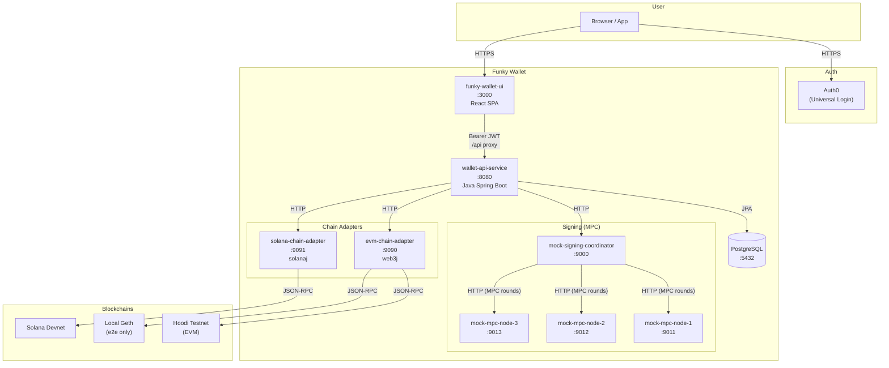
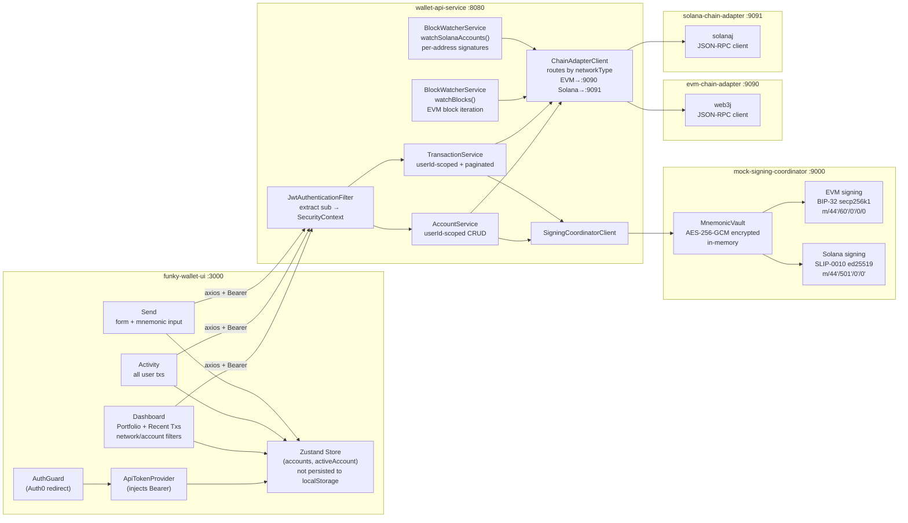
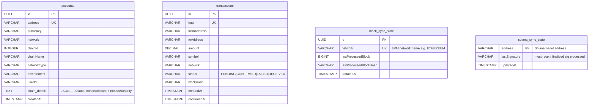
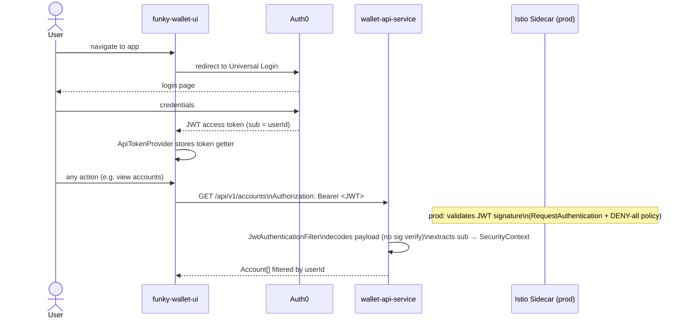
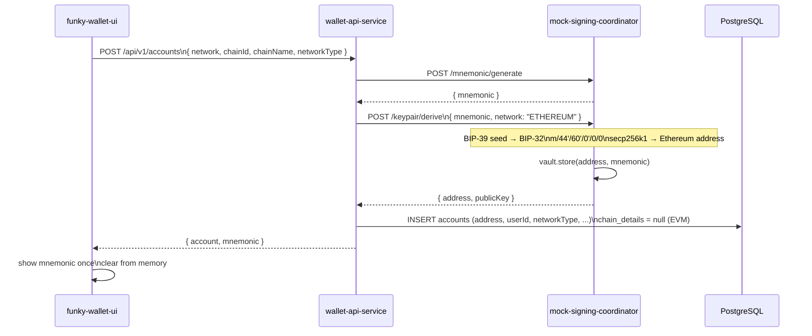
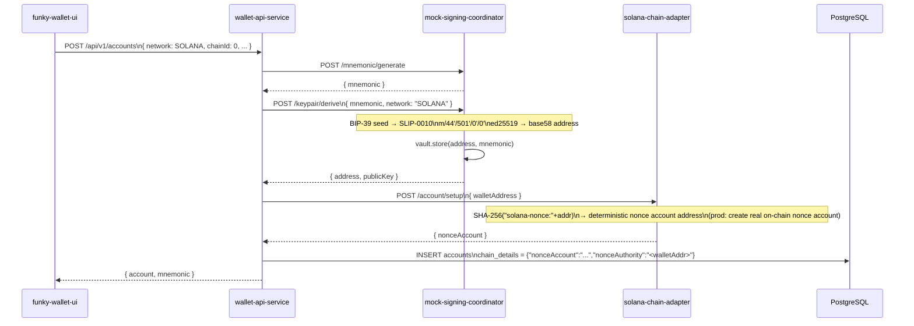
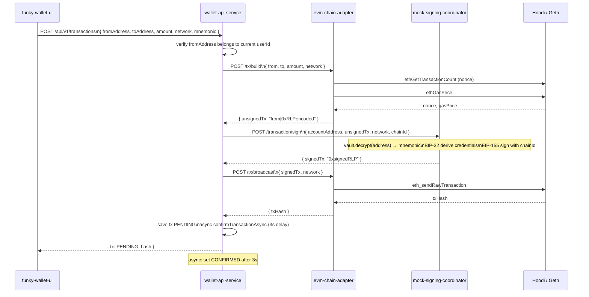
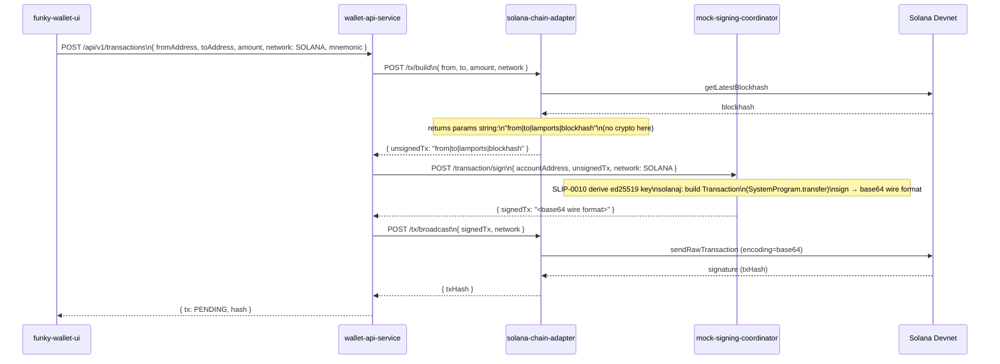
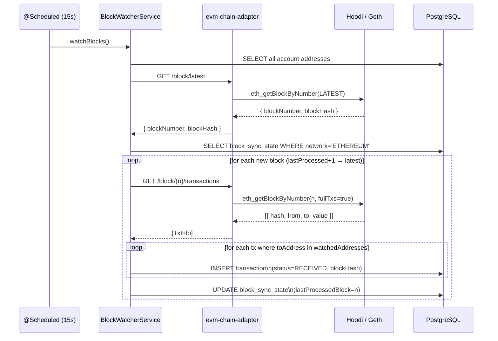
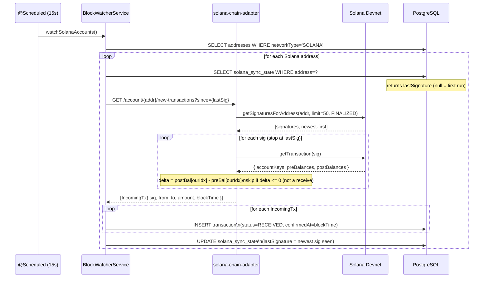

# Funky Wallet — Architecture

Funky Wallet is a non-custodial MPC wallet where private keys are split across multiple nodes and never reconstructed in one place. The mnemonic (BIP-39) is the user's recovery phrase — shown once and never stored.

---

## 1. System Overview

---

## 2. Component Detail

---

## 3. Database Schema

### `chain_details` JSON by network

| Network | Value |
|---------|-------|
| EVM | `null` |
| Solana | `{"nonceAccount":"<base58>","nonceAuthority":"<base58>"}` |
| Bitcoin (future) | `{"xpub":"...","addressType":"p2wpkh"}` |

---

## 4. Authentication Flow

---

## 5. EVM Account Creation

---

## 6. Solana Account Creation

---

## 7. Send Transaction (EVM)

---

## 8. Send Transaction (Solana)

---

## 9. EVM Incoming Transaction Detection

---

## 10. Solana Incoming Transaction Detection

---

## 11. Key Design Decisions

### MPC / Non-custodial model
- Private key material is derived from the mnemonic at signing time and immediately discarded
- The mnemonic is stored in-memory only (AES-256-GCM encrypted, keyed per address) in the signing coordinator
- The mnemonic is never persisted to disk, logs, or database at any layer
- In production this coordinator becomes a real MPC cluster (Shamir / TSS)

### JWT validation placement
- JWT signature verification is NOT in the app — Istio's `RequestAuthentication` owns it in production
- The app only base64-decodes the JWT payload to extract the `sub` claim (userId)
- `AnonymousAuthenticationToken` is treated as null userId (no identity), not as a user

### Network-specific account data
- The `accounts` table is network-agnostic
- Network-specific fields live in `chain_details TEXT` (JSON) — null for EVM, populated for Solana
- This pattern extends to Bitcoin (xpub, addressType) without new migrations

### Solana durable nonce (production TODO)
- Current: `buildUnsignedTx` uses `getLatestBlockhash` (expires ~80s)
- Required for MPC: replace with durable nonce account so signing rounds don't race expiry
- The `chain_details.nonceAccount` stores the nonce account address for this purpose
- The first instruction in a durable nonce tx MUST be `SystemProgram.nonceAdvance` (protocol rule)

### Block watcher strategy by chain
| Chain | Strategy | State |
|-------|----------|-------|
| EVM | Iterate new blocks by number | `block_sync_state.lastProcessedBlock` per network |
| Solana | Poll signatures per address | `solana_sync_state.lastSignature` per address |
| Bitcoin (future) | Poll UTXOs or use address subscriptions | TBD |
