# Funky Wallet — Architecture

Funky Wallet is a non-custodial MPC wallet where private keys are split across multiple nodes and never reconstructed in one place. The mnemonic (BIP-39) is the user's recovery phrase — shown once and never stored.

---

## 1. System Overview

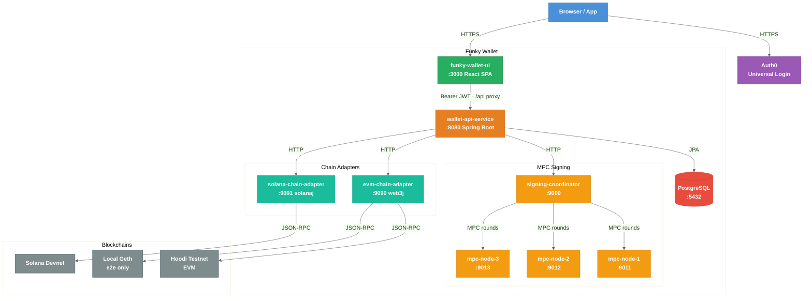

---

## 2. Component Detail

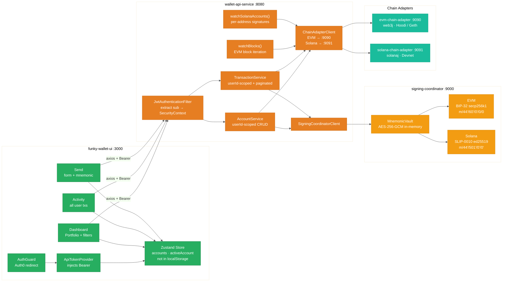

---

## 3. Database Schema

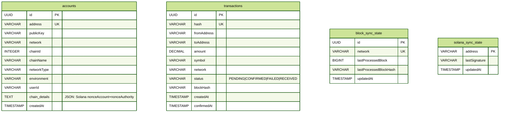

### `chain_details` JSON by network

| Network | Value |
|---------|-------|
| EVM | `null` |
| Solana | `{"nonceAccount":"<base58>","nonceAuthority":"<base58>"}` |
| Bitcoin *(future)* | `{"xpub":"...","addressType":"p2wpkh"}` |

---

## 4. Authentication Flow

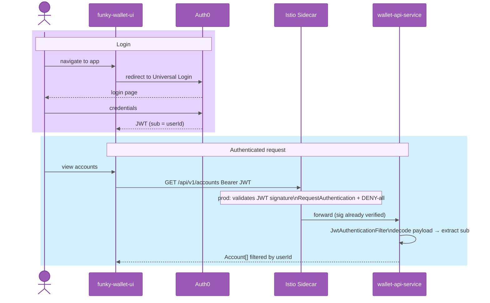

---

## 5. EVM Account Creation

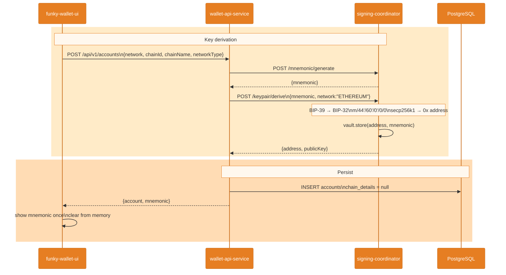

---

## 6. Solana Account Creation

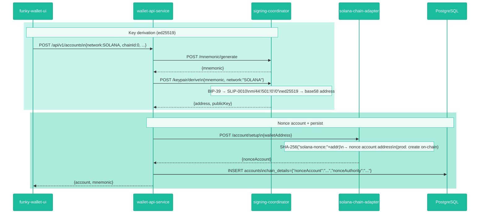

---

## 7. Send Transaction (EVM)

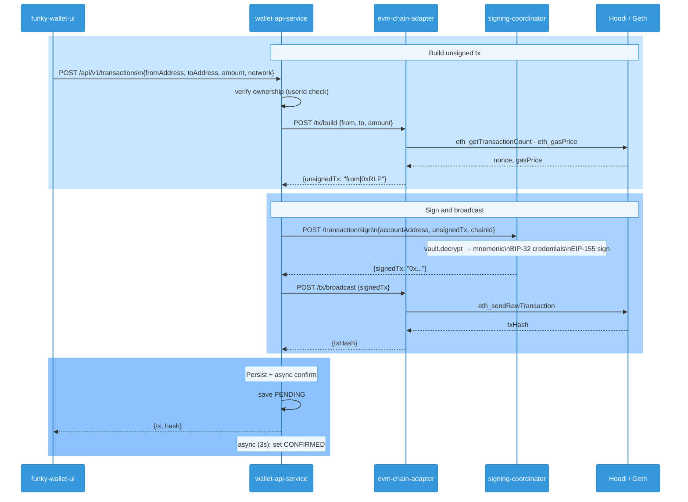

---

## 8. Send Transaction (Solana)

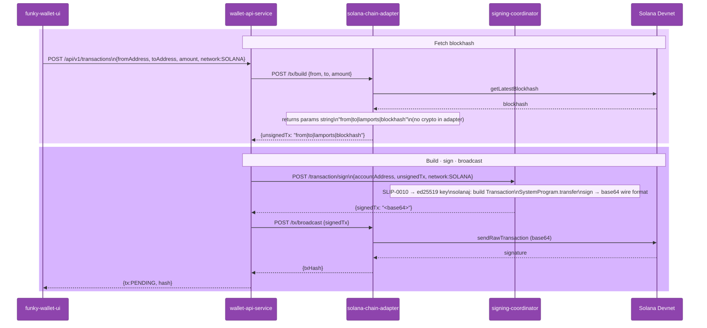

---

## 9. EVM Incoming Transaction Detection

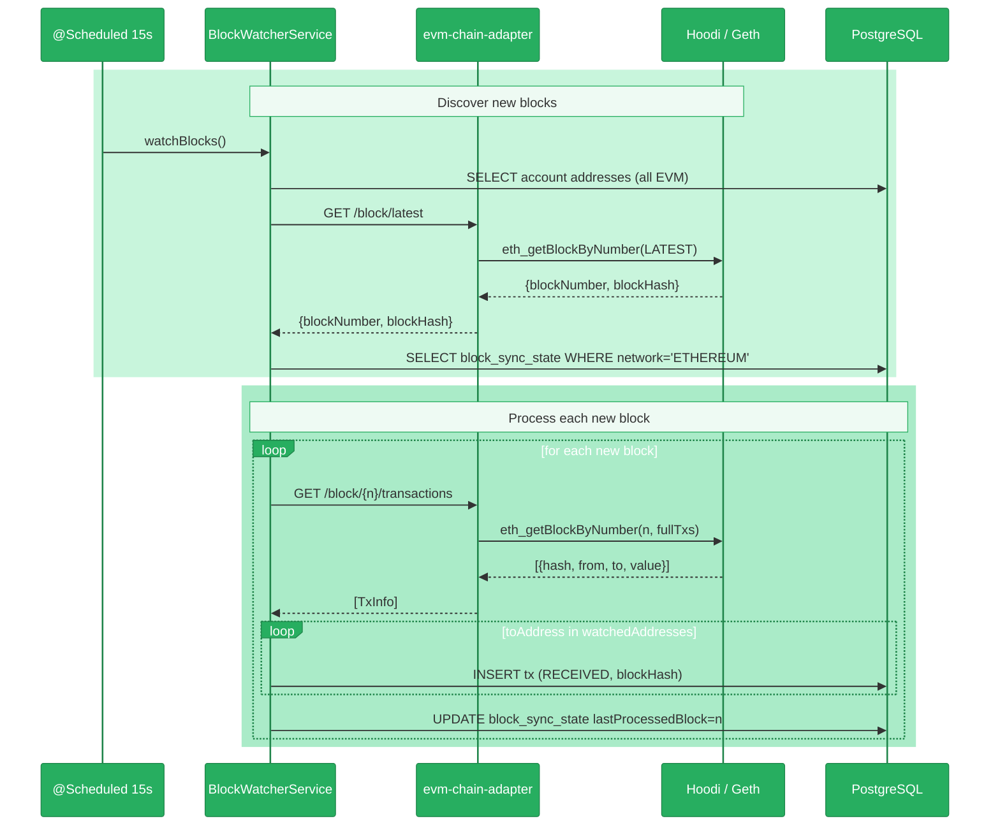

---

## 10. Solana Incoming Transaction Detection

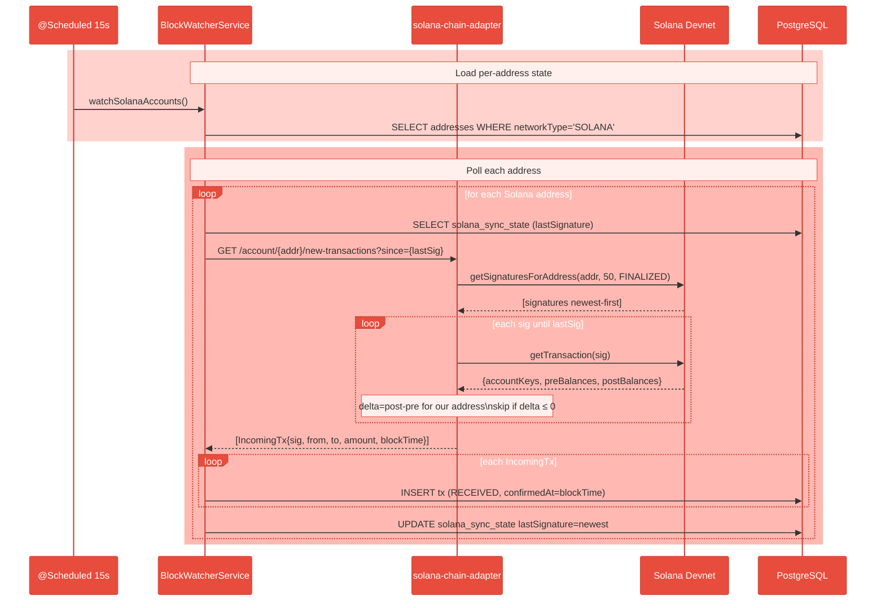

---

## 11. Key Design Decisions

### MPC / Non-custodial model
- Private key material is derived from the mnemonic at signing time and immediately discarded
- The mnemonic is stored in-memory only (AES-256-GCM encrypted, keyed per address) in the signing coordinator
- The mnemonic is never persisted to disk, logs, or database at any layer
- In production this coordinator becomes a real MPC cluster (Shamir / TSS)

### JWT validation placement
- JWT signature verification is NOT in the app — Istio's `RequestAuthentication` owns it in production
- The app only base64-decodes the JWT payload to extract the `sub` claim (userId)
- `AnonymousAuthenticationToken` is treated as null userId (no identity), not as a user

### Network-specific account data
- The `accounts` table is network-agnostic
- Network-specific fields live in `chain_details TEXT` (JSON) — null for EVM, populated for Solana
- This pattern extends to Bitcoin (xpub, addressType) without new migrations

### Solana durable nonce (production TODO)
- Current: `buildUnsignedTx` uses `getLatestBlockhash` (expires ~80s)
- Required for MPC: replace with durable nonce account so signing rounds don't race expiry
- The `chain_details.nonceAccount` stores the nonce account address for this purpose
- The first instruction in a durable nonce tx MUST be `SystemProgram.nonceAdvance` (protocol rule)

### Block watcher strategy by chain
| Chain | Strategy | State |
|-------|----------|-------|
| EVM | Iterate new blocks by number | `block_sync_state.lastProcessedBlock` per network |
| Solana | Poll signatures per address | `solana_sync_state.lastSignature` per address |
| Bitcoin *(future)* | Poll UTXOs or address subscriptions | TBD |

### Direction-aware deduplication
Each on-chain transaction can create **two DB records** — one SENT, one RECEIVED — when both ends belong to the same user (self-send). Dedup uses status-aware queries:

- `existsByHashAndFromAddressAndStatus(hash, from, CONFIRMED)` — prevents duplicate SENT records
- `existsByHashAndToAddressAndStatus(hash, to, RECEIVED)` — prevents duplicate RECEIVED records

Without the `status` predicate, the CONFIRMED record's `toAddress` would match the RECEIVED dedup check and block it. The `hash` column has **no unique constraint** by design.

### Transaction direction in UI
Direction is derived from `tx.status`, not address matching:
- `status === 'RECEIVED'` → "↓ Received"
- `status === 'CONFIRMED'` or `'PENDING'` → "↑ Sent"

Address matching fails for self-sends (sender is also a user account), making both records show as "Sent".

---

## 12. Mono-Repo Structure

All services live in a single git repository (`github.com/dipans/funky-wallet`):

```
funky-wallet/
├── .github/workflows/       ← CI/CD (GitHub Actions)
├── funky-wallet-ui/         ← React SPA (Pixel)
├── wallet-api-service/      ← Spring Boot API (Forge)
├── evm-chain-adapter/       ← EVM JSON-RPC adapter (Forge)
├── solana-chain-adapter/    ← Solana JSON-RPC adapter (Forge)
├── mock-services/           ← MPC signing + mock chain (Phantom)
├── funky-wallet-e2e/        ← Playwright e2e tests (Scout)
├── funky-infra/             ← Kubernetes + Helm + Istio (Grid)
└── geth-dev/                ← Local Geth node (e2e only)
```

Previous separate repos (`dipans/wallet-api-service`, `dipans/funky-wallet-ui`, etc.) are archived on GitHub — history preserved there.

---

## 13. CI/CD Pipeline

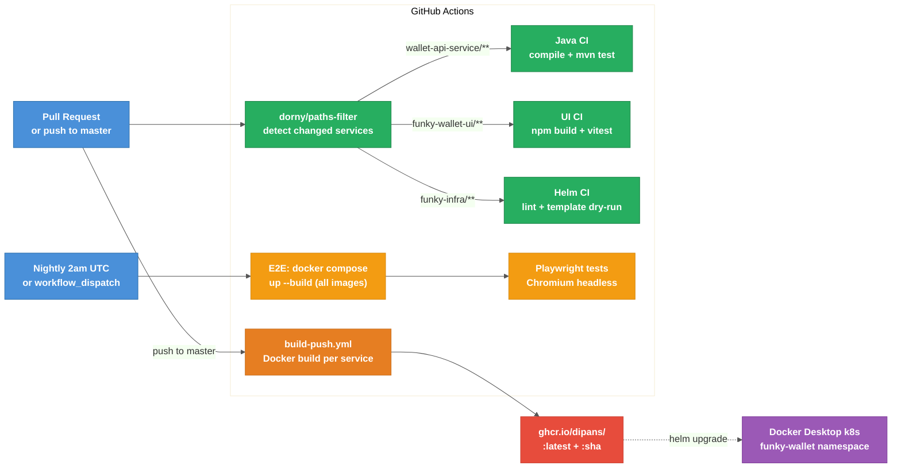

### Workflow summary

| Workflow | Trigger | Jobs |
|----------|---------|------|
| `ci.yml` | Every PR + push to master | compile + test for each changed service (path-filtered) |
| `build-push.yml` | Push to master | build Docker image + push to GHCR for each changed service |
| `e2e.yml` | Manual + nightly 2am UTC | `docker compose up --build` → Playwright Chromium tests |

### Image registry
All images at `ghcr.io/dipans/<service>` — tagged `:latest` and `:<git-sha>`.
`GITHUB_TOKEN` provides GHCR write access — no additional secrets required.

### Local k8s deploy
Docker Desktop uses the **containerd image store** (`containerd-snapshotter: true`), so locally-built images are available to k8s without a registry push:
```bash
docker build -t ghcr.io/dipans/wallet-api-service:latest wallet-api-service/
# image immediately available in k8s — no push needed
```
